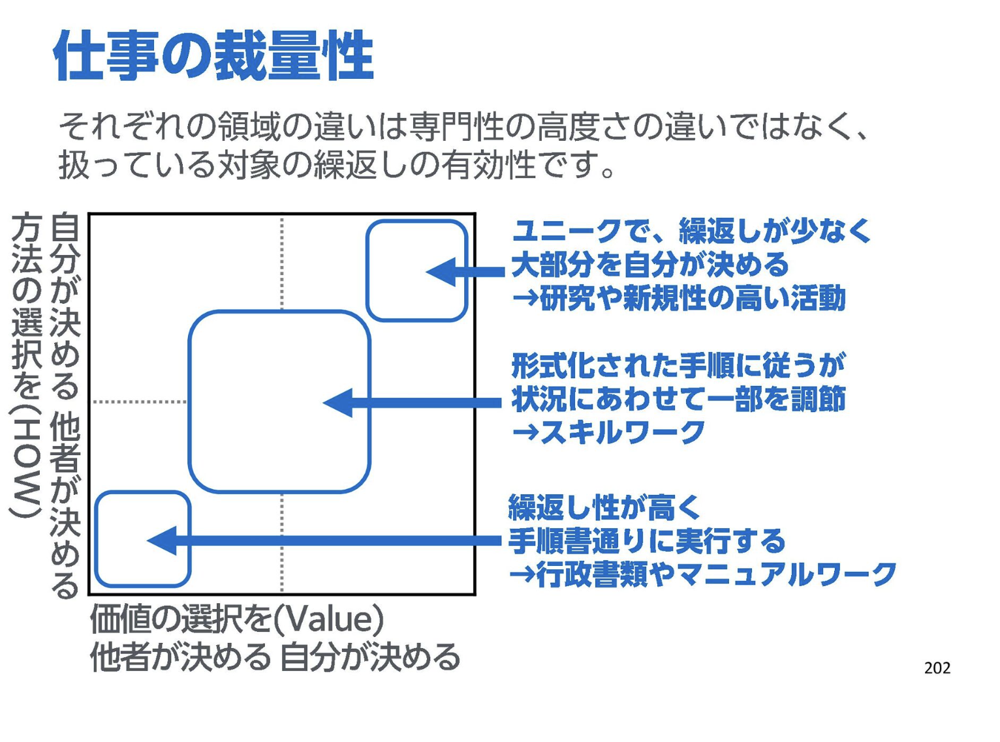

特に公開する意味はないですが、自分なりに読んだ感想をまとめておくことにしました。
あとから雑にまとめているので、雑です。

## 「プロダクトマネージャーがプロダクトマネジメントを失敗させる!?」大企業病の罠を乗り越え若々しいチームを実現する/Traps of Optimization in Product Management 2024 

### 資料
https://speakerdeck.com/moriyuya/traps-of-optimization-in-product-management-2024 

### 感想

前置きとして、現職がこういう状態という訳では無いが、可能性としてはあり得るというところを含めて以前より解像度高く読めたような気がする。

単に人を足しても人不足は解消しないのは感覚的に思っていたけど、一方で新しい人が入ってくるのは効くところと効かないところがあるなと思っていたところで以下のスライドが大変理解しやすかった。

> 上記スライドP.202より引用

緊急フロー構造はどこでも聞いたことあるし（圧倒的にJTC的なところはこればっかだった気がする）

役割分担がガイドではなくではなく厳守するルールになっているのも今振り返るとJTCで見たあれはそうだったんだろうなぁ...（だからガイドすら決めるの嫌いになっている）

とか、事例を求め始めるとかも知ってるなぁと思いながら、

なるほど、こういう構造だったのかと言うのがとても良く理解できました。

## 30分でわかるデータ指向アプリケーションデザイン - Data Engineering Study #18
### 資料
https://speakerdeck.com/xerial/30fen-dewakarudetazhi-xiang-apurikesiyondezain-data-engineering-study-number-18

### 感想

とりあえず積読を解消したい気持ちになった。

データ指向を極めたい

## ひとりで作った「理想のタスク管理ツール」は5年でこうなった（なってない）

### 資料
https://note.com/gussietech/n/ndd769923d51a

### 感想

エンジニアなら憧れる自分で作って収益化する話。

実際にやったことないのですが、始まりからの５年間をリアリティ持って読めました。

こういうの読むといつか自分もやりたいと思うけど、ツールではないんだよなぁたぶん...というわけで、その前に本業を探しに行こうという気持ちになりました。

ちなみにrepsonaも登録してみましたが、たしかにUIは使いやすそうです。担当者とボール分けられるのとか良い。実際使ってみないことには、ではありますが。

## スクラムとデッドライン壊れゆくチームをつなぎとめるもの/Scrum and Deadlines
### 資料
https://speakerdeck.com/kakehashi/kakehashi-scrum-and-deadlines?slide=5

### 感想

Xでとても話題になっていたので読みました。

品質 < 私が犠牲になろう 

じゃねーよ！！なんだけど、実際起きがちだなぁというのはあって、一旦品質を落として後で直そうという話はよくするが、結局新たにやらないといけないことは増えるので最初からある程度の品質を目指さないとだめでは・・・？みたいな気持ちになる。

ヘルプにチームで行くのは良さそうで、開発を止めて１つずつ消化できてそうな雰囲気が大変良さげに思いました。（チームに追加要件として1個乗るだけというパターンが多すぎる）

個別対応しちゃだめだよなぁ。

