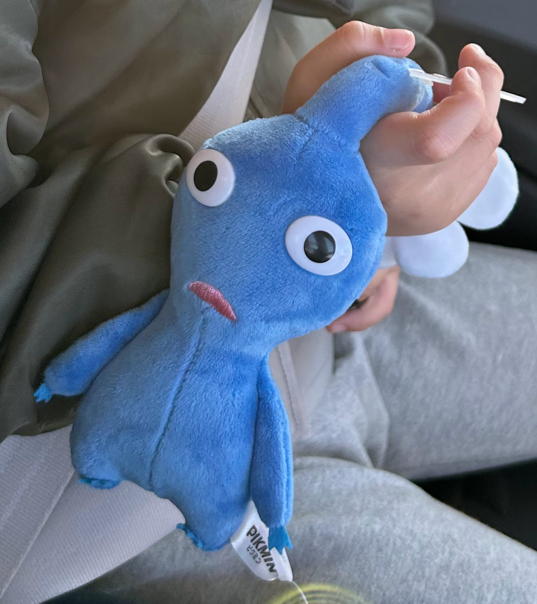

## 今週の考え事

コーヒーを最初に頑張ろうと思ったときのきっかけは、よくある話で毎回味のブレが大きくておいしかったり、とてもおいしくなかったりしたからである。

色々学んだ結果、完璧な計測はできないけれども同じ道具でちゃんと測って入れればそれなりに信頼できるデータが得られるというところで、

測れるもの(ポットのお湯の温度や粉の挽目、量、淹れるときの落ちる速度もそうだし、淹れるレシピも)は測るようにしているし、それからのほうがある程度安定した味わいになっているようには思う。

正確に言うと味的に外しても調整がしやすくなった、という印象である。

結局これは何にでも言える話で、正しいやり方を学びつつ実験しろっていうひたすらに当たり前な話なのだが、正しいやり方っていうのが少し難しいなぁと思った。

学校教育のお陰で「正解がある」ということを意識してしまっているため、その正解を探すのが癖になっているように思う。

実際、もしかすると突き詰めればどこかに正解があるのかもしれないが、そもそも解答はどうやっても見ることができない以上、正解をもとめるというよりは計測可能な方法を正しい方法として試していくしかないんだろうなぁ、と思う。

## 今週の本
### コーヒーの科学

- https://amzn.asia/d/gXdXkI8
- 上で書いた考え事は、結局この本を読んだ結果しっくり来たような気がする。とても良い本だった。

### ビジュアル スペシャルティコーヒー大事典 2nd Edition 普及版

- https://amzn.asia/d/iqneQY5
- コーヒーの科学と同時に買って読み始め。
- きれいで良い本なんだけど、コーヒーに関わる労働の話を読んでいて、俺はコーヒーを飲んでいていいんだろうか、という気持ちになった。

## 今週のピクミン4
- 長男(見る専)がやってるの見たいということで、体験版からの購入
- ライトな感じなのと、やり直しがしやすいので死に覚えがしやすくとても良い。
- 日没の音楽が可愛いと評判

- でかけた息子が祖母にねだって買ったらしい。妻には言わなかったらしくさすがである。
