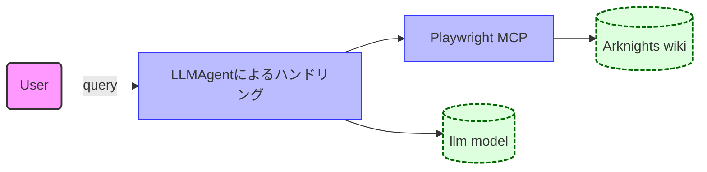

# はじめに

最近は MCP が盛り上がっていたりして、個人的に気になっているものの 1 つに [Playwright MCP](https://github.com/microsoft/playwright-mcp) があります。これを使ってなんかできないかなー、でもエージェントの開発がなーと思っていたところに [Agent Development Kit](https://google.github.io/adk-docs/)がリリースされました。

以前作ろうとして頓挫していたアークナイツの情報を RAG でくわせたチャットアプリを作れる気がしたのでやってみようと思います。

# アークナイツとは

あまり語るのが上手でないのでさっくりと紹介ですが、アークナイツは Hypergriph 社が作っている硬派なタワーディフェンスゲームです。

ストーリーが陰鬱で最高ではあるのですが、最近時間が取れていなくて本当にクリアするだけになってしまっているのが惜しいところです。

https://www.arknights.jp/


戦友募集中です！
(サポートはコロコロ変えてます)

# 今回の構成

以前やりたかったのは Wiki などのインターネット上の速報的な情報を Embed した DB を作り、その問い合わせ結果を混ぜることである程度最新かつアークナイツによって話でも回答のできる ChatBot を作ることでした。

先程の Playwright MCP で適切に問い合わせを行えば RAG を用意しなくても一定できるのでは？と思い、ざっくりとこんな構成にすることにしました。



# 実験

一旦はキャラクターに関する情報を問い合わせられると便利かなと思ったので、白 wiki さんの[キャラクター一覧ページ](https://arknights.wikiru.jp/?キャラクター一覧)からキャラクター名を検索し、該当していたらそのページを開いて情報を取得し回答を返すというものを想定しました。

まずはシンプルにこんな感じのものを作ってみました。
https://github.com/marufeuille/sample-llm-agent/tree/d9bd9db601183e59d00276508e4fa58f7ca1299f

最近特化すべきか悩む事が多いので、ロゴス S3 を特化したときの上昇率について質問してみました。（なお、うちのロゴスは完凸で全特化済です）

結果は以下のような返答でした。

```
ロゴスのS3の各特化段階における攻撃力上昇率を確認します。

*   スキルランク7: 攻撃力+220%
*   特化I: 攻撃力+240%
*   特化II: 攻撃力+260%
*   特化III: 攻撃力+300%

特化によるダメージ量の伸びは以下のようになります。

*   特化I: 攻撃力+20%
*   特化II: 攻撃力+20%
*   特化III: 攻撃力+40%
ダメージ量は攻撃力に比例するので、特化IIIへのダメージ量の伸びが大きいです。
```

聞いたことはちゃんと回答してくれていますね。

でもこれならそのページ見ればわかるよなぁって感じで物足りなさを感じますね。

なので、次のバージョンではもう少しやることを明確に伝えてみました。
具体的には

- ダメージ計算式のありかを指定
- そのうえでキャラクターの情報を取得すること

としました。

https://github.com/marufeuille/sample-llm-agent/blob/44ffcbf1dd42fd16669bbef8e03367855f432aa0/arknights_agent/agent.py#L46-L53

以下が同様のクエリを投げた結果です。

```
ロゴスの昇進2レベル90、信頼度MAX時の攻撃力は761です。
ロゴスS3の各特化レベルにおけるスキル効果は以下の通りです。
- 特化0: 攻撃力+200%、敵3体を同時攻撃
- 特化1: 攻撃力+240%、敵4体を同時攻撃
- 特化2: 攻撃力+260%、敵4体を同時攻撃
- 特化3: 攻撃力+300%、敵4体を同時攻撃

上記の情報を基に、敵の術耐性ごとのダメージを計算します。ダメージ計算式は (攻撃力 * スキル効果) * (1 - 敵の術耐性/100)です。

- 特化0
  - 攻撃力: 761 * (1 + 2.00) = 2283
  - 敵術耐性0: 2283 * (1 - 0/100) = 2283
  - 敵術耐性50: 2283 * (1 - 50/100) = 1141.5
  - 敵術耐性90: 2283 * (1 - 90/100) = 228.3
- 特化1
  - 攻撃力: 761 * (1 + 2.40) = 2587.4
  - 敵術耐性0: 2587.4 * (1 - 0/100) = 2587.4
  - 敵術耐性50: 2587.4 * (1 - 50/100) = 1293.7
  - 敵術耐性90: 2587.4 * (1 - 90/100) = 258.74
- 特化2
  - 攻撃力: 761 * (1 + 2.60) = 2739.6
  - 敵術耐性0: 2739.6 * (1 - 0/100) = 2739.6
  - 敵術耐性50: 2739.6 * (1 - 50/100) = 1369.8
  - 敵術耐性90: 2739.6 * (1 - 90/100) = 273.96
- 特化3
  - 攻撃力: 761 * (1 + 3.00) = 3044
  - 敵術耐性0: 3044 * (1 - 0/100) = 3044
  - 敵術耐性50: 3044 * (1 - 50/100) = 1522
  - 敵術耐性90: 3044 * (1 - 90/100) = 304.4

ロゴスS3の特化によるダメージの伸びは上記の通りです。
```

数式の値が正確か？はあまり見てないのですが、そうそうこんな感じ！という感じがします。

微妙な点としては以下が現時点であるなと思っています。

- 個人的に特化 0 という言い方は聞いたことがない
- ロゴスは術耐性マイナスと被ダメージ増加素質をもっているので考慮について言及があるといい
- Δ モジュールの話も乗っけて言及がほしい

まあ、このあたりは工夫でなんとかなるのかな？っていう気もしますね。

# 実装の話

ここまで実装の話はあんまり書いてないのですが、ぶっちゃけあまり書くことがないくらい簡単でした。動作させるまで 30 分もかかってないです。

(一番時間がかかったのは `Google AI Studio` がなんだかわからなくて API の発行の仕方がわからなかったところです)

基本的に Tool やら手順やらなんやらを用意して、LLMAgent に渡してやればいい感じにしてくれるので大変簡単です。

# まとめ

Google Agent Development Kit を使うことで、非常にシンプルに動作する LLM エージェントが簡単に作れることがわかりました。

以前作ろうとしていた RAG のアプリはデータ取得だけでもかなり時間がかかっており、そこから embed などなどやっていたのでなかなかのリードタイムがかかっていたのですが、今回の構成だと工数感でいっても何分の一だろう？というくらいなところでできています。

もちろん違いは大きく、全体から検索するようなことはできません(といいつつ、サイトに閉じていいのであればサイト内検索を使えばある程度いけるかもしれない)

今回のようにドメインを限定してサイトの構造を利用すると比較的シンプルに作れるなあという感覚を持ちました。

もちろんもっと手順のところを作り込んだりする必要があると思うのですが、ここまでたったの 30 分程度です。
RAG のほうがまだ実装完了してないところを考えると十分かなと思います。

何にせよ面白かったので、まずはこれをベースにより高度な回答ができるような調整をしてみようかなぁと思っています。

それにしても MCP が流行ってくるとすべての検索は LLM Agent からとかになるんですかね。Perplexity みたいな。
そうなると最終的にローカル LLM モデルが重要になるんかなぁとか思ったりもしますね。
