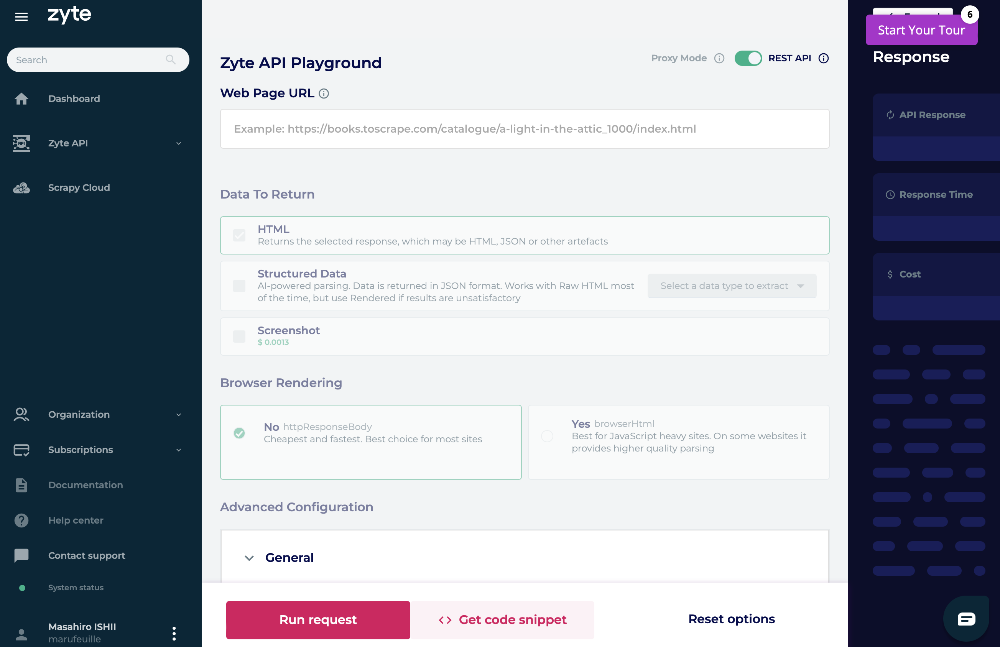
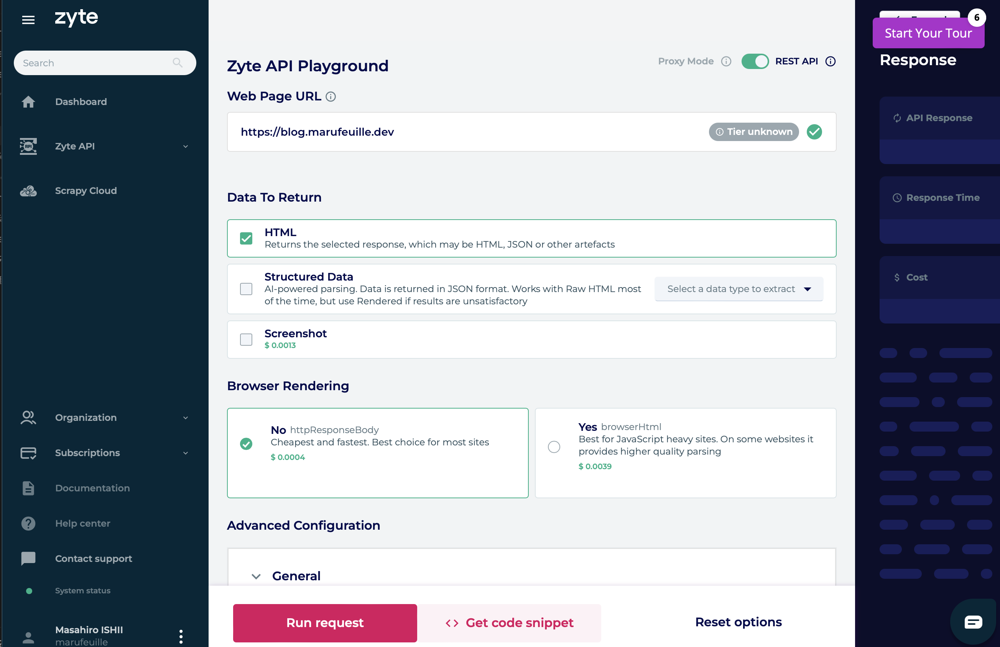
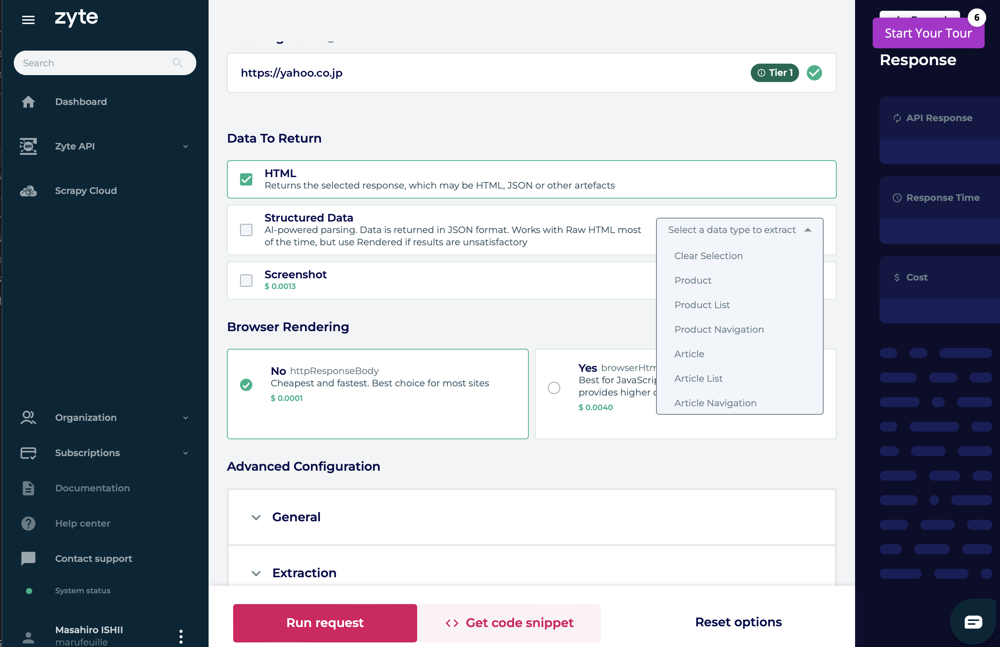
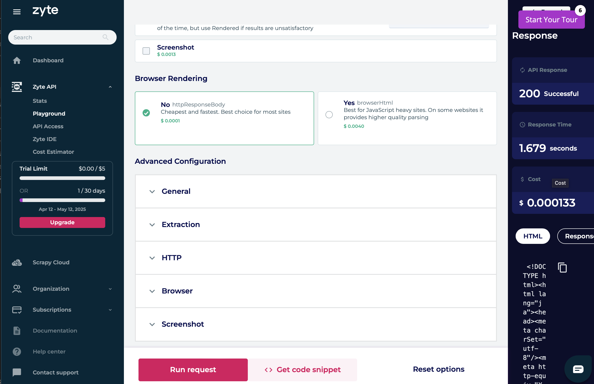
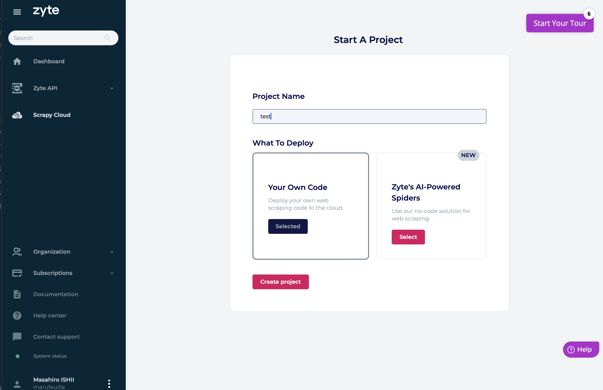
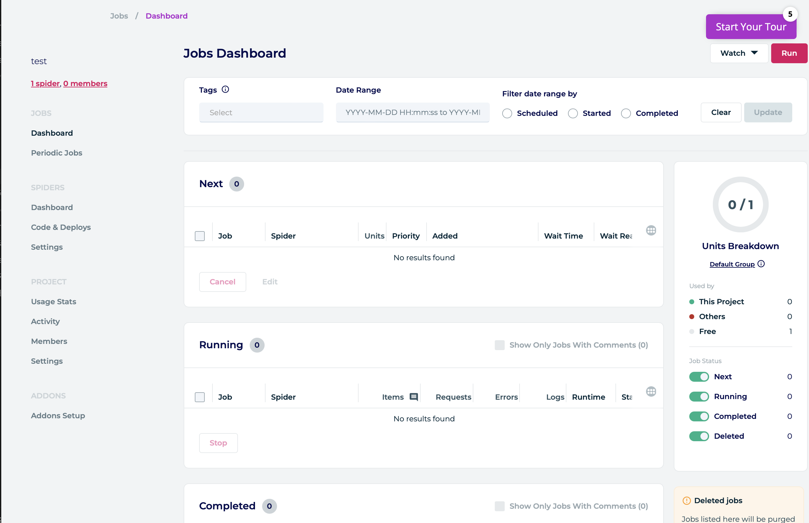
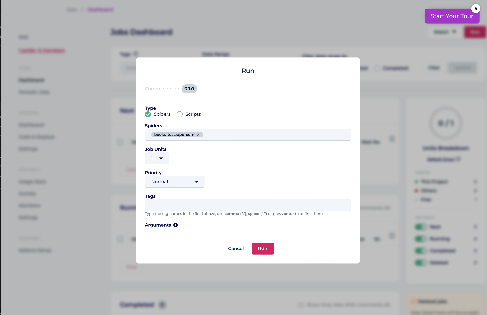
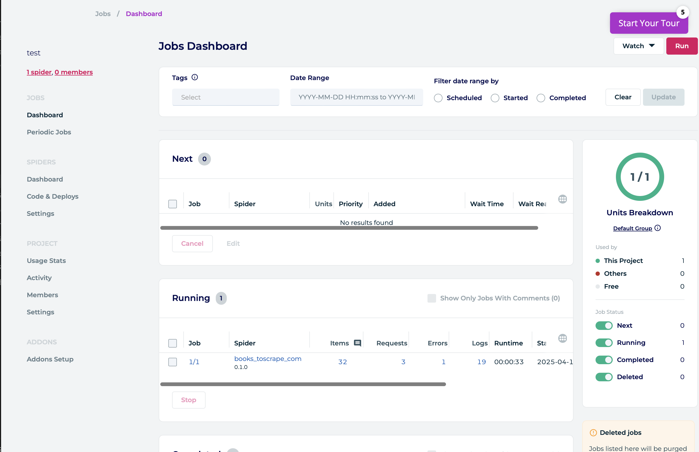
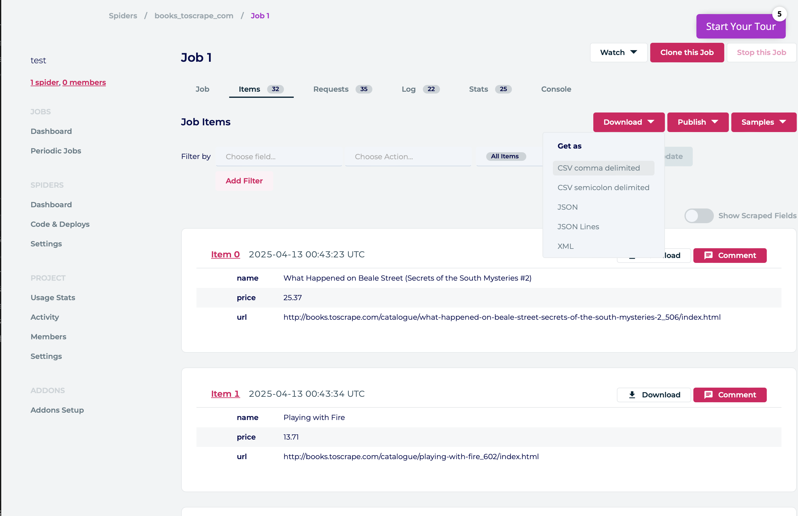

# はじめに

RAG などを自分で構築しようとしてもデータがないのはまあそうなので、Web 上から集めようとなるのだが、気をつけて作るにしても暴発のリスクはあるのでその結果 BAN でもされようものなら目も当てられない...

ということで、この間会社の同僚の方に教えてもらったスクレイピング特化の Zyte を試してみます。
今更感はありますが、私としては初物なのでご容赦ください。

# Zyte のサービスと使い所

スクレイピングは概ね以下のようなプロセスで実行されます。


flowchart LR
%% データストアの定義
urlDB[(対象 URL リスト)]:::datastore
resultDB[(取得済みデータ)]:::datastore

    %% 処理の定義
    downloader{{ダウンローダー}}:::downloader
    parser[パーサー/抽出処理]:::process

    %% 外部エンティティ
    internet[("インターネット")]:::external

    %% データフロー
    urlDB -->|HTTP Request| downloader
    downloader <-->|通信| internet
    downloader -->|HTTP Response| parser
    parser -->|抽出データ, 保存| resultDB
    parser -.->|新規URL発見| urlDB

    %% スタイル定義
    classDef datastore fill:#f9f,stroke:#333,stroke-width:2px
    classDef process fill:#bbf,stroke:#33f,stroke-width:1px
    classDef downloader fill:#ffb,stroke:#b90,stroke-width:2px
    classDef external fill:#dfd,stroke:#060,stroke-width:2px,stroke-dasharray: 5 2



非常にシンプルなのですが、難しさとしては以下のようなものが挙げられるかと思います

1. ダウンローダーを並列に効率よくやろうとすると色々と工夫がいる
   分散させて取りに行くみたいなケースだと

- 分散させて迷惑をかけないようにするのはまあまあ大変(robots.txt を見るのは当然としても、ドメイン単位でリクエスト数を制約するのは考慮が必要)
- とはいえ早く動かしたいとするとデプロイもまあまあ面倒

2.  やり方をミスるとサイトにブロックされてしまう
    個人的にも RAG のアプリケーションなんかを作るときにある程度まとまったページを取得したいと思うことはあって、そういうときはリクエストは数秒に 1 度にしているのですがそれでも相手方の基準は不明なので家の IP がブロックされたらどうしよう... みたいな気持ちにはなってます（ならやるな、なのですが、RAG を作りたいというモチベーションにはかてません）
    行儀よくやるのは前提であったとしてもどうしてもリスクが残ってしまう部分はあります。

これらに対して Zyte は以下のようなサービスを展開しています。

- Zyte API
  - リクエストの間に挟まり主に 2 の問題を解消できそう
  - リクエストするページの難易度 x リクエストの成功数の課金
- AI Scraping
  - あまり興味がなかった（個人的に用途がなさそうだった）ので詳しく調べていないのですが、LLM を使っていい感じにデータを取りに行く、みたいな感じです
  - リクエストするページの難易度 x リクエストの成功数の課金 (Zyte API より高い)
- Scrapy Cloud
  - スクレイピングするときに使うミドルウェアである Scrapy をマネージドなインフラ上で実行できるサービスです
  - デプロイ数ベースの月額課金

図にすると以下のような分布です。


flowchart LR
%% データストアの定義
urlDB[(対象 URL リスト)]:::datastore
resultDB[(取得済みデータ)]:::datastore

    %% 処理の定義
    downloader{{ダウンローダー}}:::downloader
    parser[パーサー/抽出処理]:::process
    zyteapi[ZyteAPI]:::zyteapi

    %% 外部エンティティ
    internet[("インターネット")]:::external

    %% データフロー
    subgraph ScrapyCloud
        urlDB -->|HTTP Request| downloader
        downloader -->|HTTP Response| parser
        parser -->|抽出データ, 保存| resultDB
        parser -.->|新規URL発見| urlDB
    end
    downloader <--> |通信| zyteapi
    zyteapi <--> |通信| internet

    %% スタイル定義
    classDef datastore fill:#f9f,stroke:#333,stroke-width:2px
    classDef process fill:#bbf,stroke:#33f,stroke-width:1px
    classDef downloader fill:#ffb,stroke:#b90,stroke-width:2px
    classDef external fill:#dfd,stroke:#060,stroke-width:2px,stroke-dasharray: 5 2



# Zyte 入門

せっかくなので、多少触ってみます。
とはいえ上記のとおりだとすると、特別難しいことはなさそうですね。

## ZyteAPI

アカウントを開設すると以下のような画面に行き着きました


とりあえず、ほぼ迷惑のかからないであろう自分のブログを対象にしてみます


Zyte はその URL の Tier、つまり獲得難易度によって課金が別れているそうです。
僕のサイトは Unknown でしたが、天下の yahoo 様で Level1, amazon.co.jp で Level2 でした。
(特にスクレイピングする予定はないのですが...)

おもしろいのがこのへんで、AI を使って特定の形式のデータをまとめてくれるようです。確かにサイトを掘って商品リストを取ってくる、なんて使い方はありそうです。


とりあえず適当に設定して撮ってみました。


Get code snippet から curl コマンドが取り出せました。
こちらだとリクエスト料金が output に含まれていないようなので、使いすぎは注意かもしれませんね。

```bash
curl \
  --user hogehogefugafuga: \
  --header 'Content-Type: application/json' \
  --data '{
 "url": "https://blog.marufeuille.dev/",
 "httpResponseBody": true,
 "httpRequestMethod": "GET"
  }' \
  --compressed "https://api.zyte.com/v1/extract"
```

かえってくるものは base64 エンコードされているので、こんな感じにすると取り出せます

```bash
curl \
  --user hogehogefugafuga: \
  --header 'Content-Type: application/json' \
  --data '{
 "url": "https://blog.marufeuille.dev/",
 "httpResponseBody": true,
 "httpRequestMethod": "GET"
  }' \
  --compressed "https://api.zyte.com/v1/extract" | jq -r .httpResponseBody  | base64 -d

  % Total    % Received % Xferd  Average Speed   Time    Time     Time  Current
                                 Dload  Upload   Total   Spent    Left  Speed
100 19934    0 19832  100   102  13383     68  0:00:01  0:00:01 --:--:-- 13459
<!DOCTYPE html>
<html lang="en" dir="auto">

<head>
	<meta name="generator" content="Hugo 0.118.2"><meta charset="utf-8">
<meta http-equiv="X-UA-Compatible" content="IE=edge">
<meta name="viewport" content="width=device-width, initial-scale=1, shrink-to-fit=no">
<meta name="robots" content="index, follow">
<title>Caffeine-Fueled Code</title>

<meta name="description" content="ITとカフェイン">
<meta name="author" content="">
<link rel="canonical" href="https://blog.marufeuille.dev/">
...
```

まあ僕のサイトくらい単純なサイトなら $0.000133 なので、1 万ページとって 1 ドルですね。
Scrapy は使うほどのことはしないけど、自分の端末から静的なページを安全に取りに行きたい、みたいなときは噛ませておくといいかもしれませんね。

## Scrapy Cloud

次に Scrapy Cloud を試してみます。
基本的に[ここ](https://docs.zyte.com/web-scraping/tutorials/main/setup.html) にある tutorial を試していきます


手順は tutorial のとおりなのでスクショだけ。デプロイするとこんな感じになって



こんなふうに Run します


実行中はこんな画面でリアルタイムに進行がわかります。


こんな感じで結果も取得できるようです。


僕は Scrapy に処理させるよりは生 html があればあとはそれを個別にゴリッとするほうが書きやすいと思っている派なので、あんまり使うことはなさそうですが確かに簡単に使えたので Scrapy を乗せたいのならいいかもしれませんね。

# まとめ

Zyte を使うことで、バンのリスクなどを回避しながら完全に時前で実施するよりは楽に Web ページのスクレイピングができました。
ただこれ、使い方によってはかなりブラックなので節度を守って使っていくのが大切ですね。
(ドキュメント見ると robots.txt に関する言及すらないしなあ)
